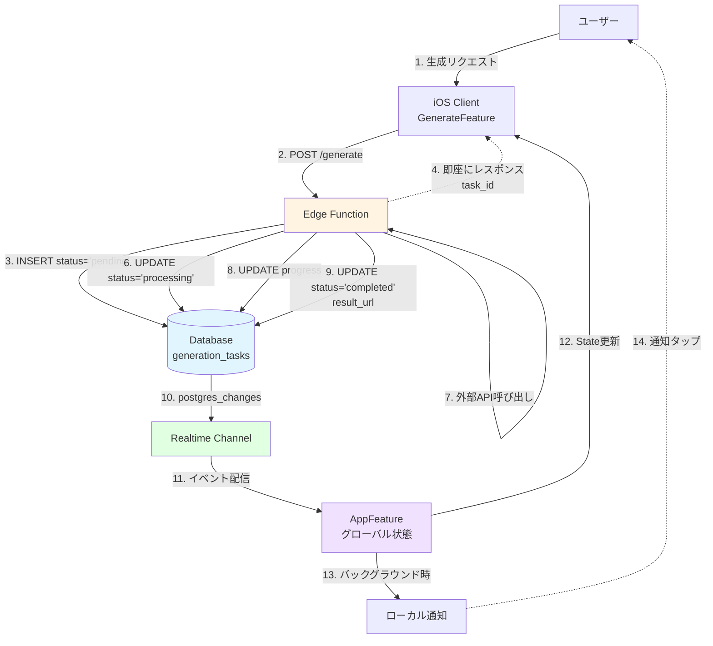
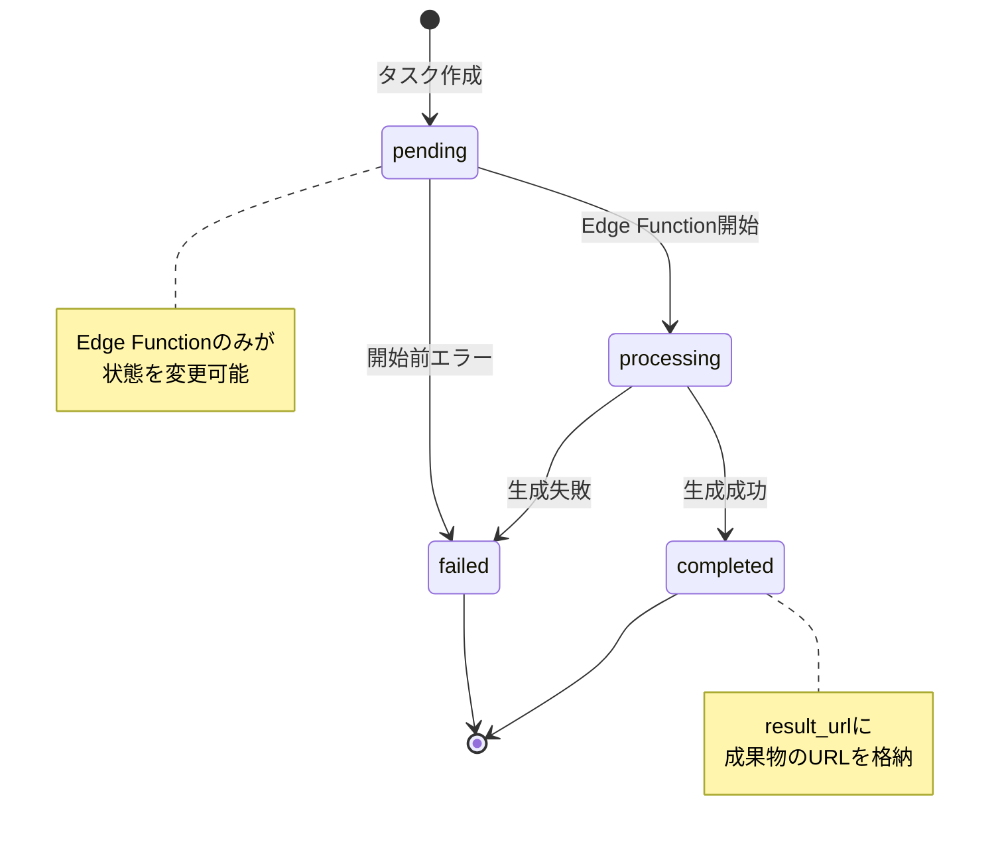
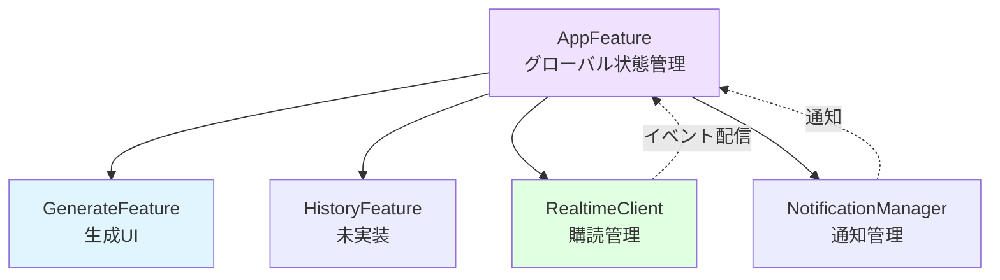
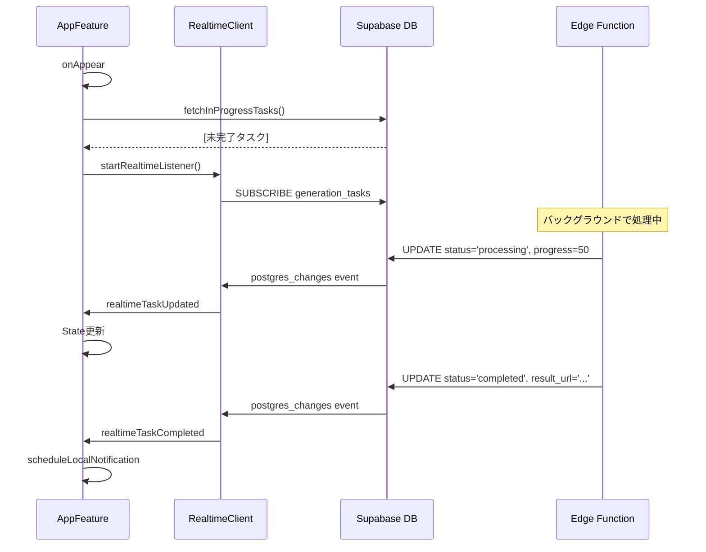
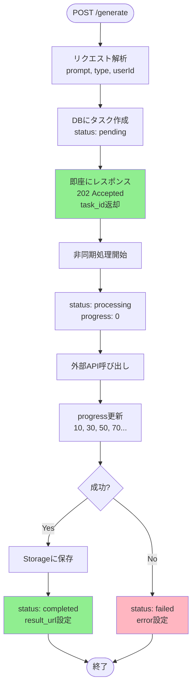
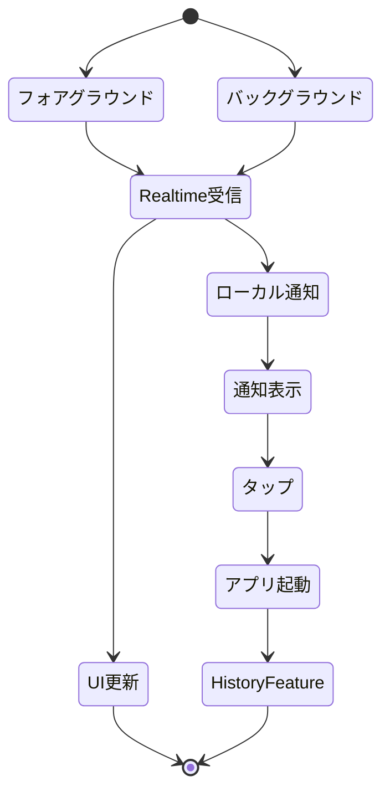
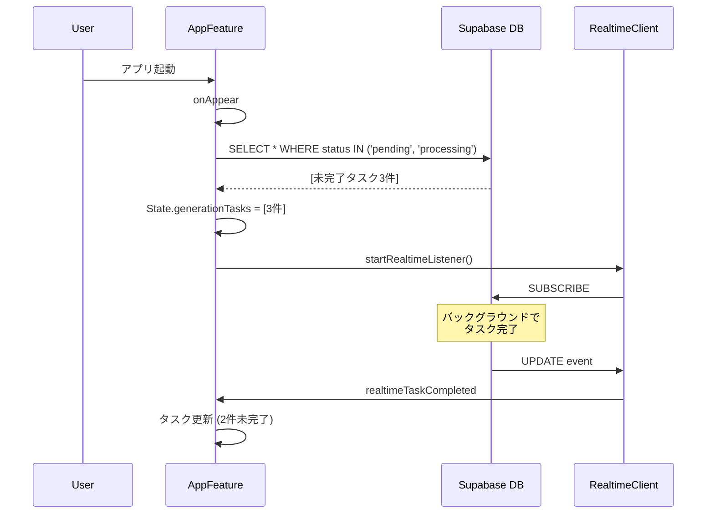

# 生成タスク経過管理 設計書

## 概要

画像・音楽生成のような長時間処理をSupabase Realtime + Database Triggersで管理する設計。
アプリがバックグラウンド・終了状態でも処理を継続し、完了時に通知する。

## 要件

- ✅ 生成中に他の画面に遷移可能
- ✅ 他のアプリを起動しても処理継続
- ✅ 複数タスクの同時実行
- ✅ アプリ再起動時に未完了タスクを復元
- ✅ フォアグラウンド: Realtime通知
- ✅ バックグラウンド: ローカルプッシュ通知

## アーキテクチャ

### 責務分離

| コンポーネント | 責務 | 状態の権限 |
|--------------|------|----------|
| **Edge Function** | タスク生成・実行・外部API呼び出し | 書き込みのみ |
| **Database** | 状態の永続化（Single Source of Truth） | 保存 |
| **Realtime** | 状態変更の配信 | 読み取り配信 |
| **AppFeature** | グローバルタスク管理・復元 | 読み取りのみ |
| **GenerateFeature** | 生成UI・ユーザー操作 | 読み取りのみ |
| **HistoryFeature** | 完了済みタスク表示（未実装） | 読み取りのみ |

### データフロー全体図



## 状態管理

### 状態遷移図



### 状態遷移ルール

| 遷移 | 実行者 | 条件 |
|------|--------|------|
| `pending → processing` | Edge Function | 外部API呼び出し開始時 |
| `processing → completed` | Edge Function | 生成完了・Storage保存完了 |
| `processing → failed` | Edge Function | API/Storage エラー |
| `pending → failed` | Edge Function | バリデーションエラー |

**重要**: クライアント側は状態を変更しない（読み取り専用）

## データベース設計

### テーブル: generation_tasks

```sql
CREATE TABLE generation_tasks (
  id UUID PRIMARY KEY DEFAULT gen_random_uuid(),
  user_id UUID REFERENCES auth.users(id) NOT NULL,
  type TEXT NOT NULL CHECK (type IN ('image', 'music')),
  status TEXT NOT NULL CHECK (status IN ('pending', 'processing', 'completed', 'failed')),
  progress INTEGER DEFAULT 0 CHECK (progress >= 0 AND progress <= 100),
  prompt TEXT,
  result_url TEXT,
  error TEXT,
  created_at TIMESTAMPTZ DEFAULT NOW(),
  updated_at TIMESTAMPTZ DEFAULT NOW()
);

-- インデックス
CREATE INDEX idx_generation_tasks_user_id ON generation_tasks(user_id);
CREATE INDEX idx_generation_tasks_status ON generation_tasks(status);
CREATE INDEX idx_generation_tasks_created_at ON generation_tasks(created_at DESC);

-- RLS
ALTER TABLE generation_tasks ENABLE ROW LEVEL SECURITY;

CREATE POLICY "Users can view own tasks"
  ON generation_tasks FOR SELECT
  USING (auth.uid() = user_id);

CREATE POLICY "Service role can insert tasks"
  ON generation_tasks FOR INSERT
  WITH CHECK (true);

CREATE POLICY "Service role can update tasks"
  ON generation_tasks FOR UPDATE
  USING (true);
```

## iOS実装設計（TCA）

### コンポーネント構成



### AppFeature（グローバル状態）

**State**
- `generationTasks: IdentifiedArrayOf<GenerationTask>`
- `isListeningToRealtime: Bool`

**Action**
- アプリライフサイクル: `onAppear`, `onDisappear`
- タスク管理: `fetchInProgressTasks`, `tasksLoaded`
- Realtime: `startRealtimeListener`, `realtimeTaskUpdated`, `realtimeTaskCompleted`
- 通知: `scheduleLocalNotification`

### GenerateFeature（生成UI）

**State**
- `prompt: String`
- `isGenerating: Bool`

**Action**
- ユーザー操作: `promptChanged`, `generateButtonTapped`
- Edge Function応答: `generationStarted`, `generationFailed`
- 親への委譲: `delegate(Delegate)`

### Realtime購読フロー



## Edge Function設計

### 処理フロー



### エンドポイント仕様

**リクエスト**
```
POST /functions/v1/generate
Content-Type: application/json
Authorization: Bearer <supabase-anon-key>

{
  "prompt": "beautiful sunset over mountains",
  "type": "image",
  "userId": "uuid"
}
```

**レスポンス（即座）**
```
HTTP 202 Accepted

{
  "task_id": "uuid"
}
```

## 通知設計

### 通知タイミング



### 通知内容

| タイプ | タイトル | 本文 | アクション |
|--------|---------|------|-----------|
| 完了 | "生成完了" | "{type}の生成が完了しました" | アプリ起動→詳細表示 |
| 失敗 | "生成失敗" | "エラーが発生しました" | アプリ起動→エラー詳細 |

## 復元フロー



## エラーハンドリング

### Edge Function側

| エラー種別 | 対応 | DB状態 |
|-----------|------|--------|
| API呼び出し失敗 | リトライ（3回） | `status: failed`, `error`設定 |
| タイムアウト | 10分後自動失敗 | `status: failed` |
| Storage保存失敗 | リトライ（2回） | `status: failed` |

### クライアント側

| エラー種別 | 対応 |
|-----------|------|
| Realtime接続失敗 | 5秒後に再接続（最大3回） |
| タスク取得失敗 | エラー表示＋リトライボタン |
| 通知権限なし | 設定画面への誘導 |

## 実装順序

1. **Supabase設定**
   - テーブル作成
   - RLS設定
   - Realtime有効化

2. **Edge Function**
   - タスク作成エンドポイント
   - 非同期処理ロジック
   - ステータス更新

3. **iOS - AppFeature**
   - グローバル状態管理
   - Realtimeクライアント実装
   - タスク復元ロジック

4. **iOS - GenerateFeature**
   - UI実装
   - Edge Function呼び出し
   - 進行状況表示

5. **通知**
   - ローカル通知設定
   - 権限リクエスト
   - 通知ハンドリング

6. **HistoryFeature（後日）**
   - 完了済みタスク一覧
   - 詳細表示
   - 削除機能

## 参考資料

- [Supabase Realtime](https://supabase.com/docs/guides/realtime)
- [Supabase Edge Functions](https://supabase.com/docs/guides/functions)
- [TCA Architecture](https://pointfreeco.github.io/swift-composable-architecture/)
