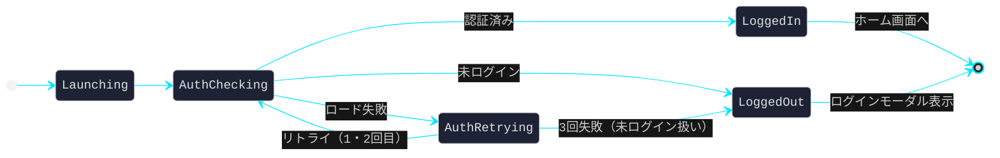
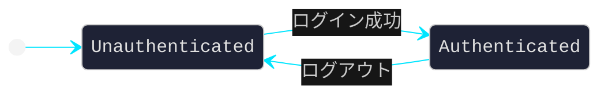
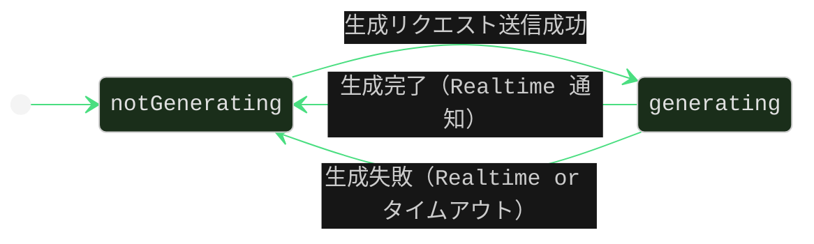
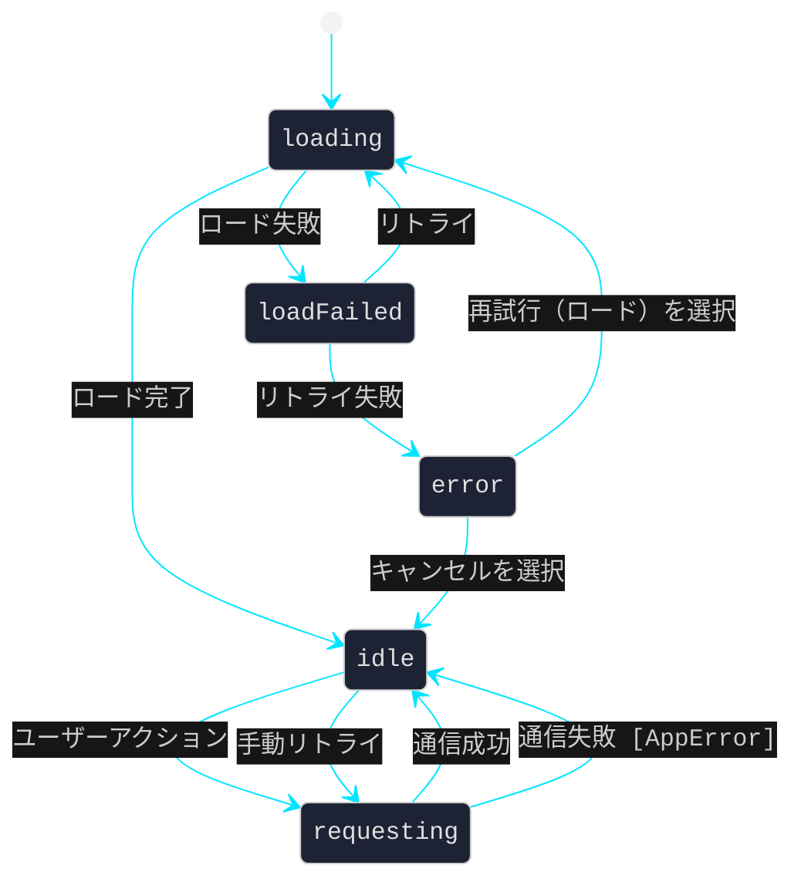
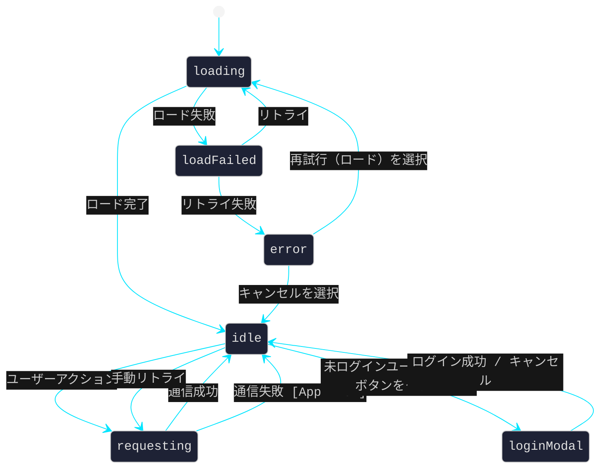
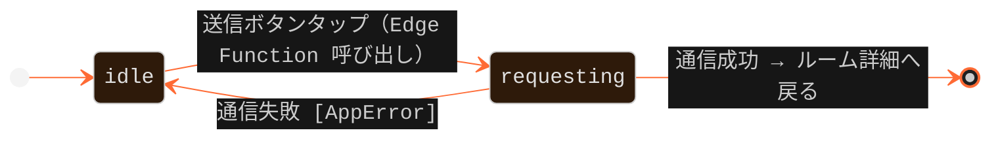
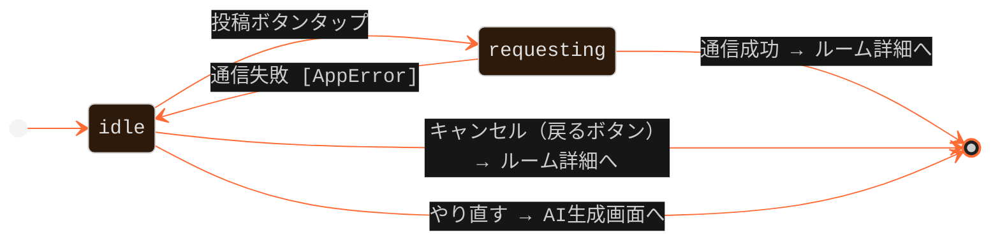
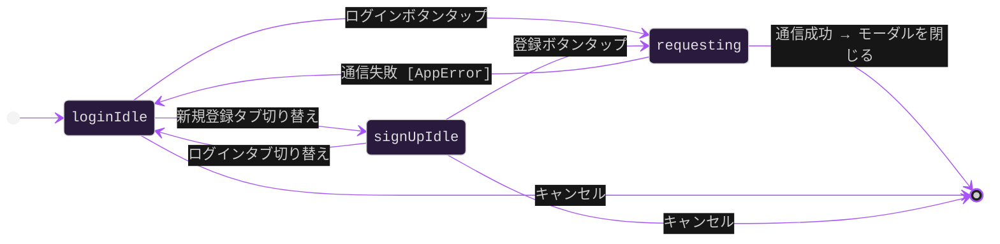
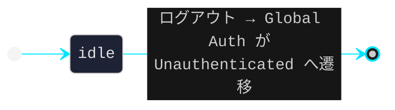

# STATE TRANSITION DIAGRAM
**AI Content SNS — 状態遷移図 / FSM Specification · 2026-03-14**

---

## 01 — アプリ起動

> App 起動時の認証状態チェックフロー（AppFeature / Application）

---

## 02 — 全体：認証状態（Global Auth）

> アプリ全体で保持するセッション状態

---

## 03 — 全体：コンテンツ生成状態（Global Generation）

> Authenticated と**並行して保持**。Supabase Realtime で `status` 変化を監視

| 項目 | 内容 |
|---|---|
| 監視テーブル | `image_contents` / `music_contents` |
| フィルタ | `user_id = eq.{currentUserId}` |
| イベント | `UPDATE` — `status` が `generating → completed` に変化したタイミング |

---

## 04 — ルームリスト

> `RoomListFeature` (iOS · TCA) · `RoomListViewModel` (Android · MVVM)
>
> ⚑ Global Generation（03）と**並行して動作**

### AppError — エラー種別定義

| ErrorType | 説明 |
|---|---|
| `networkError` | ネットワーク障害 / タイムアウト |
| `usageLimitExceeded` | 無料プランの生成回数上限超過（サーバー側で判定・返却） |
| `serverError(code: Int)` | サーバーエラー（5xx 系） |
| `unauthorized` | 認証切れ → ログインモーダルへ誘導 |

---

## 05 — ルーム詳細

> `RoomDetailFeature` (iOS · TCA) · `RoomDetailViewModel` (Android · MVVM)
>
> ⚑ Global Generation（03）と**並行して動作**

---

## 06 — AI生成画面

> `GenerateFeature` (iOS · TCA) · `GenerateViewModel` (Android · MVVM)

**通信成功後の副作用**
- `image_contents.status` = `"generating"` で DB レコード作成済み（Edge Function が更新）
- Global Generation が `notGenerating → generating` に遷移
- `usageLimitExceeded` は `AppError` として返却 → `idle` に戻りエラー表示

---

## 07 — 生成結果画面

> `ResultFeature` (iOS · TCA) · `ResultViewModel` (Android · MVVM)

---

## 08 — ログイン / 新規登録モーダル

> `AuthFeature` (iOS · TCA) · `AuthViewModel` (Android · MVVM)

---

## 09 — 設定画面

> `SettingsFeature` (iOS · TCA) · `SettingsViewModel` (Android · MVVM)

